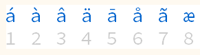
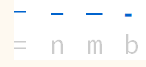

Insert⏎ custom symbols by holding a key
 
and selecting from a character picker

## Introduction

[char🠿](<./char🠿.ahk>) binds a hold-over-insert chars on key Hold via a Mac-like Press&Hold character picker: 
     
    

## Install

  - Copy this repository and double-click on [char🠿_launch](./char🠿_launch.ahk)  
    OR
  - Copy libraries from `lib` to your own `lib` sub-folder
  - Copy `gVar` to your own `gVar` folder
  - Copy [char🠿](./char🠿.ahk.ahk) to your main AutoHotkey folder
  - Import the main script `#Include %A_scriptDir%\char🠿.ahk	; Diacritics+chars on key hold`

## Configure

  - [char🠿](./char🠿.ahk.ahk) contains the hotkey definitions and what set of symbols those hotkeys should use to show a symbol picker (see 4 steps marked by `;;;` to update)
  - [symbol](./gVar/symbol.ahk) contains a few Maps of symbols that can be updated to insert whatever symbols you need
  - [PressH](<./gVar/PressH.ahk>) contains a set of visual tweaks (like fonts and colors) and `TimerHold` hold threshold (0.4sec by default)
  - [varWinGroup](./varWinGroup.ahk) contains the list of apps where this script should be enabled

## Known issues
  - Caret detection fails in many apps (like Chrome) and would require a use of a UIAutomation/Accessibility library

## Credits
