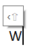

<p align="center">
Proof of concept for home row mods
<br>
in AutoHotkey
</p>
<p align="center">  
(without activation delays introduced by timing-only approach)
</p>


## Introduction

Home row modifier (⌂mod) is a key that

  - located at the most convenient home row position (e.g., <kbd>f</kbd>)
  - on a single tap acts as usual and types its letter (`f`)
  - on hold acts as a modifier (e.g., <kbd>⇧</kbd>)

Usually the difference between a tap and a hold is determined __only based on time__ since key↓, i.e., if you hold <kbd>f</kbd> longer than 1 second, it becomes <kbd>⇧</kbd>. However, this introduces a mental hurdle as you can't use it in the same convenient manner you'd use a regular <kbd>⇧</kbd>, but always have to keep that artificial delay in mind.

Another approach is to __send the letter on__ key↓ and then <kbd>␈</kbd> __clean it up__ if it's being held. But this could backfire outside a text field where <kbd>␈</kbd> could be a "go history back" command in a browser (and text field detection is unfortunately not 100% reliable). This also breaks fast typing as typing `fi` while holding <kbd>f</kbd> could clean up `i` instead of `f`

This script tries to use 2 heuristics to detect a hold of a ⌂mod (but only for <kbd>f</kbd> as a ⌂<kbd>⇧</kbd>)

1) time:     definitely a HOLD if held longer than X

2) sequence: maybe a HOLD depending on whether the next key

  - is tapped <kbd>a↕</kbd> (pressed down and released), this is a Hold of ⌂<kbd>f</kbd>
  - or only pressed <kbd>a↓</kbd><kbd>f↑</kbd>, this is just fast `fa` typing where it's common to press the next button before the first one is released

This script also adds a taphold example of a conditonal behavior driven by another app: <kbd>h</kbd> sends <kbd>⎋</kbd> when Sublime Text's modal editing plugin NeoVintageous is in Insert mode to exit it and otherwise sends `h`. This allows for the most convenient and reliable way to exit insert mode (key sequences like <kbd>j</kbd><kbd>k</kbd> are more convenient, but not 100% reliable since you maybe have workds containing `jk` or )

A slightly more complicated set of actions depending on the sequence of keys is described below:

### Legend:

  ↓ key down<br/>
  ↑ key up<br/>
  ↕ key tap<br/>
  🠿 key hold<br/>
  • perform action at this point<br/>
  •>ΔH perform action at this point only after ⌂tHold seconds<br/>
  •<ΔH perform action at this point only if ⌂tHold seconds has __NOT__ passed<br/>
  ⌂ home row modtap key (e.g., <kbd>f</kbd> types `f` with a single tap, but becomes <kbd>⇧</kbd> on hold) <br/>
  a any regular key (not modtap)<br/>

⌂↓ always activates our modtap input handler, so won't be marked as •
Key sequences and how to treat them:
```
Sequence    Label Comment
a↓ ⌂↓ a↑ ⌂↑ ↕     modtap starts after another key, should let the prior key finish
      •      xx)  print nothing (a is printed outside of this script)
         •  ↕xz)  print ⌂
a↓ ⌂↓ b↓ a↑ ⌂↑ ↕
         •   x_x) print nothing (a is printed outside of this script, b )
⎈↓ ⌂↓ ⎈↑⌂↑       not a tap, swallowed by the modifier
         •   00)  print nothing, but send ⌂↑ so other apps can reset ⌂↓ state that they saw because our ⌂ hook wasn't active on ⌂↓
⌂↓       ⌂↑ ↕     single standalone tap, not hold
     <ΔH •  ↕01)  print ⌂
    •>ΔH    🠿0t)  enable ⌂ (⇧⌂ enabled on timer via input hook's timeout)
⌂↓ a↓ ⌂↑ a↑ ↕     should be ⌂,a as that's just fast typing
•            0a)  print nothing, don't know the future yet, just activate input hook
<ΔH•         ?0b) print nothing, don't know whether to print ⇧A or ⌂,a, the hold depends on the next key sequence
      •     ↕2a)  print ⌂,a
         •  ↕2b)  print nothing, 2a handle it
>ΔH•        🠿0c) print ⇧A (⇧⌂ enabled on timer 🠿0t), A is printed outside of the scripts purview)
⌂↓ a↓ a↑ ⌂↑ 🠿    should be ⇧A, not ⌂
   •              same as above
   <ΔH•     🠿1aa) print ⇧A, also set ⌂ var as a modifier since we know it's not quick typing
   <ΔH   •  🠿1ba) print nothing, 1a handles key, ⌂ is a mod
   >ΔH•     🠿1ab) print nothing, 0c handled key↓ (⇧⌂ enabled on timer 🠿0t)
   >ΔH   •  🠿1bb) print nothing, 1a handles key, ⌂ is a mod

if ⌂🠿
  a↓...      __)  not tracked, regular typing with modtap enabled
  ⌂↓   ⌂↑
  •          _1)  do nothing, block repeat of the
       •     _2)  reset
if alt⌂↓          another modtap key is active (but not switched to a hold yet, so inputhook is in progress)
⌂↓       ⌂↑ ↕     single standalone tap, not hold
     <ΔH •  _↕01)  print ⌂
    •>ΔH    _🠿0t)  enable ⌂ (⇧⌂ enabled on timer via input hook's timeout of the alt⌂)
⌂↓ a⌂↓ ⌂↑ a⌂↑ ↕   should be ⌂,a⌂ as that's just fast typing
•            0a)  =above print nothing, don't know the future yet, just activate input hook
<ΔH•         ?0b) =above print nothing, don't know whether to print ⇧A or ⌂,a⌂, the hold depends on the next key sequence
       •    _↕2a) ≠print ⌂, but not a⌂ as it's a mod and may become a hold
           •       treat a⌂ as a regular ⌂, so this depends on a⌂ timings
```

## Install

Download all the files in this branch and double click `⌂mod_modtap_launch.ahk`
(`lib` folder contains the needed libraries, `gVar` — the needed variables)

## Use

- Type `f`to get the expected `f`fog
- Type `fog` quickly to get the expected `fog`
- Type `fu` quickly, but hold onto <kbd>f</kbd> for a tiny bit longer (release it after releasing <kbd>u</kbd>) to get `U`
- Hold <kbd>f</kbd> for longer than 0.5 seconds, then type <kbd>u</kbd> get `U` without an `f`

For taphold contitional key <kbd>h</kbd>
- Hold <kbd>h</kbd> for longer than 0.5 seconds when in Insert mode of Sublime Text's NeoVintageous plugin to exit it (send <kbd>⎋</kbd>)

## Configure

  Adjust configuration variables in the `global ucfg⌂mod := Map` line of the script
  - Set `tooltip⎀` (enabled by default) to show a tooltip near the text cursor (caret) with an indicator of a modifier status, e.g., after holding <kbd>f</kbd> and tapping <kbd>w</kbd> you'd get `‹⇧` indicator  like 
  - Delay showing `tooltip⎀` via `tt⎀delay`. This is helpful if you don't like tooltip flashes on using modtap only once for a single key (like <kbd>⇧</kbd>), but would still like to have it to understand when `holdTimer` has expired. If you release a modtap during this delay, `tooltip⎀` will be cancelled and not be shown
  - Change the hold duration via `holdTimer`
  - Ignore selected keys from activating a given modtap, e.g., you can exclude same-side keys to avoid <kbd>f</kbd><kbd>e</kbd> from inserting `E` even if your released <kbd>f</kbd> after <kbd>e</kbd> (assuming <kbd>f</kbd> is a modtap <kbd>⇧</kbd>)

## Known issues

- only <kbd>⇧</kbd> is implemented so far
  - <kbd>f</kbd> as ⌂<kbd>‹⇧</kbd>
  - <kbd>j</kbd> as ⌂<kbd>⇧›</kbd>
- same-type opposite-side modifiers are disabled, so if ⌂<kbd>f</kbd>(‹⇧) is activated as a Hold, then ⌂<kbd>j</kbd>(⇧›) won't activate, but will act like a regular key
- interaction between ⌂<kbd>‹⇧</kbd> and ⌂<kbd>⇧›</kbd> sometimes breaks: fast typing of `fgj` skips `j`
- <kbd>␠</kbd> triggers home row mod as a regular alphanumeric key (even though it has no upper-cased variant and in principle shouldn't interact with a modtap key) instead of breaking the hold check and printing the key itself. Current solution is to add it to the `ignored` keys
- tapping same-side real modifier (e.g., <kbd>‹⇧</kbd>) resets the status of the homerow modifier, and the latter doesn't track&reset itself. Maybe not a real issue since a home row mod is designed to be identical to the real one, so this should be expected?
- (fixed? haven't seen in a while)<kbd>f</kbd>🠿<kbd>v</kbd>🠿 longer than `holdTimer` sometimes prints `pPP...` instead of `PPP...`, might be a limitation of AutoHotkey's inputhook mechanism where the sent modifier down event is not registered fast enough to have an effect on the continuously held regular key

## Credits
